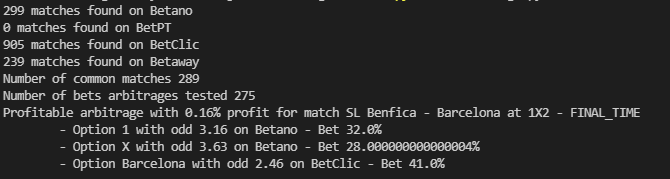

# ArbitrageScanner

A small project that scans winners bets in multiple bookmakers in search for potentially arbitrages.
The project is built with future updates in mind, thus use a WebsiteBase class in website_base.py to act as an interface between the different Bookmakers.
To add a new bookmaker just extend WebsiteBase and implement the following methods: parseFRBet, getMatchList, getMatch, saveRawEvent, saveRawMatchList.

The current supported bookmakers are: Betano, Betclic and Betway.
The RadarBet id is used to link similar matches and compare between bookmakers.
By defining additional parsing methods on the WebsiteBase class is possible to add more bets to be scanned and compared.

## How to run
``` python arbitrage.py ```

## Example output
This is an example of a real test where a profitable arbitrage with 0.16% profit was found.


## Known Problems
- For some reason Betway private API sometimes does not return the BetRadarID, thus ignoring some bets.
- Some bets are not being correctly parsed from Betway.
- BetPT is corrently using websockets and does only scrap Football sports


## Remarks
Passing debug=True to each bookmaker on arbitrage.py will produce a json file for every match or bet where a parsing error has ocurred, also changing the logging info to WARNING or info will produce more logs.
There ir also an ``` eval.ipynb ``` that might come in handy to debug feature bookmakers.